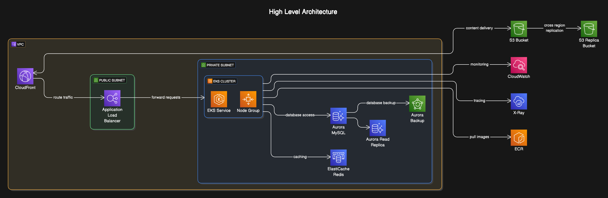

# Architecture Overview

## Component Selection and Rationale

### 1. Compute Resources

- **Amazon EKS (Elastic Kubernetes Service)**
  - Provides managed Kubernetes for container orchestration
  - Eliminates need to install, operate, and maintain Kubernetes control plane
  - Built-in security with AWS IAM integration and encrypted worker node volumes
  - Automated version updates and patching
  - Native integration with other AWS services (ALB, CloudWatch, IAM)
  - Cost-effective through right-sizing and auto-scaling capabilities
  - Supports both On-Demand and Spot instances for worker nodes

### 2. Load Balancing

- **Application Load Balancer (ALB)**
  - Layer 7 (HTTP/HTTPS) load balancing
  - Intelligent routing with support for path/host-based routing and priority rules
  - Native integration with AWS WAF for enhanced security
  - Automatic scaling based on incoming traffic
  - Built-in SSL/TLS termination and certificate management
  - Cross-zone load balancing for improved availability
  - Integrates with EKS through AWS Load Balancer Controller

### 3. Content Delivery and Storage

- **Amazon CloudFront CDN**

  - Global content delivery network with 400+ edge locations
  - Automatic request routing to nearest edge location
  - Built-in DDoS protection through AWS Shield
  - Integration with AWS WAF for security
  - Support for custom SSL certificates
  - Origin failover capabilities for high availability
  - Pay-as-you-go pricing model with no upfront commitments
  - Options to choose different pricing categories

- **Amazon Aurora MySQL**

  - Fully managed MySQL-compatible database with enhanced reliability
  - Distributed, fault-tolerant, self-healing storage system
  - Up to 15 read replicas with sub-10ms replication lag
  - Multi-AZ deployment with instant failover (< 30 seconds)
  - Automated continuous backup with point-in-time recovery
  - Cost optimization through serverless option for dev/test
  - Up to 66% cost savings compared to standard MySQL
  - Automatic storage scaling and zero-downtime patching
  - Built-in monitoring and performance insights

- **Amazon S3**

  - Highly durable (99.999999999%) object storage
  - Lifecycle policies for automatic tiering to save costs
  - Versioning support for data protection
  - Server-side encryption with KMS integration
  - Object lock for WORM (Write Once Read Many) compliance
  - Integration with CloudFront for optimized content delivery
  - Cost-effective storage classes (Standard, IA, Glacier)

- **Amazon Elastic Container Registry (ECR)**
  - Fully managed container registry for storing application container images
  - Integrated with EKS for seamless container deployment
  - Encryption at rest using KMS
  - IAM authentication for access control
  - Lifecycle policies for automated image cleanup
  - High availability and durability for container images

### 4. Caching Layer

- **Amazon ElastiCache for Redis**
  - Managed Redis service for session management and caching
  - Multi-AZ with automatic failover
  - Reduces database load and improves performance

### 5. Security Components

- **VPC Design**

  - Private subnets for application and database layers
  - Public subnets only for load balancers
  - NAT Gateways for outbound internet access
  - Single NAT Gateway in non-production environments to optimize costs
  - Multiple NAT Gateways in production for high availability
  - VPC Flow Logs enabled for network monitoring
  - VPC Endpoints for secure access to other AWS service

- **Security Groups and NACLs**
  - Layered security approach
  - Principle of least privilege

### 6. Monitoring and Logging

- **CloudWatch**
  - Metrics, logs, and alarms
  - Custom dashboards for application insights
- **AWS X-Ray**
  - Distributed tracing
  - Performance optimization

### 7. Backup and Recovery

- **RDS Automated Backups**
  - Daily snapshots with point-in-time recovery
- **S3 Cross-Region Replication**
  - Disaster recovery strategy

## Cost vs Performance Trade-offs

1. **EKS Node Management**

   - Use spot instances for non-critical workloads
   - Reserved instances for baseline capacity
   - On-demand for peak periods

2. **Database Sizing**

   - Start with smaller instances
   - Scale vertically based on monitoring data
   - Use read replicas only when necessary

3. **Caching Strategy**
   - Implement intelligent cache invalidation
   - Right-size Redis clusters based on usage patterns
   - Use Cloudfront as a CDN for static content

## Scaling Policies

1. **Horizontal Pod Autoscaling**

   - CPU and memory-based scaling
   - Custom metrics for business-specific scaling

2. **Cluster Autoscaling**

   - Node group scaling based on pod demands
   - Buffer capacity for rapid scaling

3. **Database Scaling**
   - Vertical scaling for primary instance
   - Read replicas for read-heavy workloads
